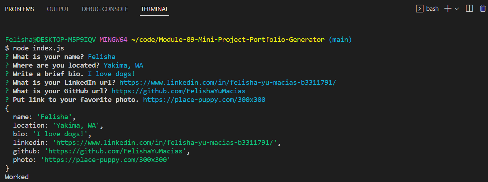
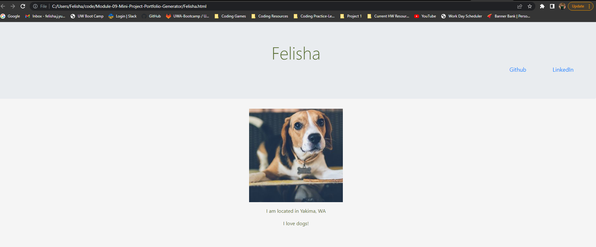

# Module-09-Mini-Project-Portfolio-Generator
In this activity, you will build a command-line tool that generates an HTML portfolio page from user input.

## Instructions

* Your application should prompt the user for information like their name, location, bio, LinkedIn URL, and GitHub URL. Feel free to add any additional prompts you think of.

* An HTML document containing the information collected from the prompts should be constructed and written to the file system. Be sure to add some CSS styling to the document.

* You’ll need the following tools and technologies to accomplish this:

  * `fs` for writing to the file system

  * `inquirer` version 8.2.4 for collecting user input

  * String template literals for generating a string version of the HTML document before it is written to the file system

### 💡 Hints

It might be a good idea to start building out the HTML skeleton in a real HTML file. Once you're happy with the HTML file's appearance in the browser, you can copy and paste its contents into a string template literal. Then you can write a function to insert the user input into the appropriate places in the HTML string before writing it to the file system.

## Usage

* Open index.js in terminal and run node index.js
* Answer questions to prompts
* After prompts are answered a new html document titled your name will be created.

### Screenshots

## License
MIT License

Copyright (c) 2022 Felisha

Permission is hereby granted, free of charge, to any person obtaining a copy
of this software and associated documentation files (the "Software"), to deal
in the Software without restriction, including without limitation the rights
to use, copy, modify, merge, publish, distribute, sublicense, and/or sell
copies of the Software, and to permit persons to whom the Software is
furnished to do so, subject to the following conditions:

The above copyright notice and this permission notice shall be included in all
copies or substantial portions of the Software.

THE SOFTWARE IS PROVIDED "AS IS", WITHOUT WARRANTY OF ANY KIND, EXPRESS OR
IMPLIED, INCLUDING BUT NOT LIMITED TO THE WARRANTIES OF MERCHANTABILITY,
FITNESS FOR A PARTICULAR PURPOSE AND NONINFRINGEMENT. IN NO EVENT SHALL THE
AUTHORS OR COPYRIGHT HOLDERS BE LIABLE FOR ANY CLAIM, DAMAGES OR OTHER
LIABILITY, WHETHER IN AN ACTION OF CONTRACT, TORT OR OTHERWISE, ARISING FROM,
OUT OF OR IN CONNECTION WITH THE SOFTWARE OR THE USE OR OTHER DEALINGS IN THE
SOFTWARE.
